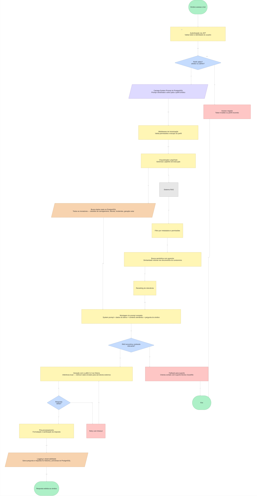

# GoodWeAI — EV ChargeOps Assistant

> Chatbot com IA desenvolvido para o **EV Challenge 2026** em parceria com a **GoodWe** e a **FIAP**, focado na gestão operacional de eletropostos em condomínios residenciais.

---

## Integrantes

| Nome | RM |
|------|----|
| A preencher | A preencher |
| A preencher | A preencher |
| A preencher | A preencher |

---

## Problema Abordado

O EV Challenge 2026 apresenta dois problemas centrais relacionados à infraestrutura de carregamento de veículos elétricos:

- **ChargeGrid Intelligence**: ausência de mecanismos integrados nos eletropostos para orquestrar potência, registrar ciclos de carregamento e faturar automaticamente.
- **EV ChargeOps**: falta de ferramentas para gerenciar o uso compartilhado de eletropostos em condomínios residenciais, incluindo controle de acesso, consumo por unidade e comunicação com moradores e síndicos.

O GoodWeAI endereça o problema **EV ChargeOps**, oferecendo uma solução conversacional que permite ao síndico e aos moradores interagirem com os dados do sistema de forma natural, sem necessidade de navegar por painéis técnicos complexos.

---

## Proposta do Chatbot

O **GoodWe AI** é o assistente virtual do GoodWeAI, operando em dois modos distintos conforme o perfil do usuário autenticado:

### Agente Síndico / Admin
Atende síndicos e administradores com acesso completo aos dados operacionais do condomínio:
- Consulta de consumo por apartamento e por eletroposto
- Relatórios de sessões de carregamento (duração, kWh, custo)
- Situação financeira: faturas pendentes, inadimplência
- Status e histórico de incidentes por eletroposto
- Geração solar por unidade e saldo de energia

### Agente Morador
Atende moradores com escopo restrito ao atendimento geral:
- Dúvidas sobre políticas de uso dos eletropostos
- Informações sobre tarifas e formas de pagamento
- Canais de suporte e contato
- Regras do condomínio

A separação entre agentes garante que dados sensíveis de outros moradores não sejam expostos indevidamente.

---

## Tecnologias Utilizadas e Justificativa Técnica

| Tecnologia | Função | Justificativa |
|------------|--------|---------------|
| **Python 3.11** | Linguagem principal do backend | Ecossistema maduro para IA e APIs REST |
| **FastAPI** | Framework da API REST | Alta performance, tipagem nativa, documentação automática via Swagger |
| **LLaMA 3.2** | Modelo de linguagem (LLM) | Modelo open-source, executado localmente via Ollama, sem custo de API e sem envio de dados para terceiros |
| **Ollama** | Servidor local do LLM | Permite rodar o LLaMA 3.2 localmente no Windows/Mac/Linux com um único comando |
| **LangChain** | Orquestração do pipeline de IA | Gerencia o fluxo entre prompt, contexto e modelo, com suporte a templates e cadeias de processamento |
| **PostgreSQL** | Banco de dados relacional | Armazena usuários, sessões de carregamento, faturas, incidentes e geração solar |
| **pgvector** | Extensão vetorial do PostgreSQL | Permite busca semântica por similaridade diretamente no PostgreSQL, eliminando a necessidade de um banco vetorial separado |
| **SQLAlchemy** | ORM Python | Abstração do banco de dados com suporte a migrations e queries tipadas |
| **JWT (python-jose)** | Autenticação | Tokens stateless com perfis diferenciados por assinatura digital |
| **bcrypt** | Hash de senhas | Padrão da indústria para armazenamento seguro de credenciais |

### Por que LLaMA local e não OpenAI/Gemini?

A escolha pelo LLaMA 3.2 rodando localmente via Ollama foi deliberada:
- **Privacidade**: dados sensíveis do condomínio (consumo, inadimplência, incidentes) não trafegam para servidores externos.
- **Custo zero de inferência**: sem cobrança por token em produção.
- **Independência**: o sistema funciona sem conexão com APIs de terceiros.

### Por que pgvector e não ChromaDB?

O pgvector foi escolhido por consolidar a busca semântica dentro do mesmo PostgreSQL já utilizado pelo sistema. Isso elimina um banco de dados extra, simplifica o backup, permite queries combinando dados relacionais e vetoriais, e reduz a complexidade de deploy em produção.

---

## Arquitetura do Sistema

```
┌─────────────────────────────────────────────────┐
│                   INTERFACES                     │
│   chat.html · sindico.html · admin.html          │
└────────────────────┬────────────────────────────┘
                     │ HTTP / REST
┌────────────────────▼────────────────────────────┐
│                BACKEND — FastAPI                  │
│  /auth  →  JWT + perfis                          │
│  /chat  →  Agente Síndico / Agente Morador       │
│  /ev    →  Sessões, eletropostos, faturas        │
│  /admin →  Usuários, prompts, histórico          │
└──────────┬──────────────────┬───────────────────┘
           │                  │
┌──────────▼──────┐  ┌────────▼──────────────────┐
│   PostgreSQL    │  │   LLaMA 3.2 via Ollama     │
│  + pgvector     │  │   (inferência local)       │
│                 │  │                            │
│  usuarios       │  │  Contexto injetado:        │
│  eletropostos   │  │  · Dados do banco          │
│  sessoes        │  │  · System prompt           │
│  faturas        │  │  · Busca semântica         │
│  incidentes     │  │    (pgvector)              │
│  geracao_solar  │  │                            │
│  system_prompts │  └────────────────────────────┘
│  historico      │
└─────────────────┘
```

---

## Fluxo de Funcionamento



O fluxo completo do pipeline GoodWeAI:

1. **Autenticação** — usuário acessa o bot e o sistema consulta o perfil via JWT
2. **Roteamento** — conforme o perfil (Síndico ou Morador), o agente correspondente é ativado com seu system prompt carregado do PostgreSQL
3. **Middleware de autorização** — valida permissões e escopo do perfil
4. **Orquestração LangChain** — gerencia o pipeline de execução
5. **Sistema RAG** — filtro por metadados e permissões → busca semântica com pgvector → reranking de relevância
6. **Montagem do prompt** — contexto do banco (db_context_service) + documentos semânticos + histórico + instrução
7. **Decisão de qualidade** — se o RAG não encontrou conteúdo relevante, aciona fallback para suporte
8. **Geração com LLaMA 3.2** — via Ollama, inferência local
9. **Validação da resposta** — se falhar, aciona retry com timeout
10. **Pós-processamento** — formatação e sanitização da resposta
11. **Logging e observabilidade** — métricas, traces e auditoria
12. **Resposta exibida ao usuário**

---

## Modelo de Teste — Perguntas e Respostas Esperadas

### Agente Síndico

| # | Pergunta | Resposta Esperada |
|---|----------|-------------------|
| 1 | Qual usuário mais consumiu energia este mês? | O assistente consulta a tabela `sessoes_carregamento`, agrega por `usuario_id` e retorna o nome, apartamento, total em kWh e custo acumulado do período. |
| 2 | O eletroposto EP-04 está funcionando? | Consulta a tabela `eletropostos` pelo código EP-04 e retorna o status atual (ex: "em manutenção"), localização e data de instalação. |
| 3 | Quais faturas estão pendentes? | Consulta `faturas` com status "pendente", lista os moradores, valores e datas de vencimento. |
| 4 | Houve algum incidente esta semana? | Consulta `incidentes` filtrando pelos últimos 7 dias, retorna tipo, eletroposto envolvido e status de resolução. |
| 5 | Qual foi o total de energia carregada no condomínio em maio? | Agrega `energia_kwh` de todas as sessões do mês, retorna total em kWh e custo total do condomínio. |

### Agente Morador

| # | Pergunta | Resposta Esperada |
|---|----------|-------------------|
| 1 | Como faço para reservar um eletroposto? | Retorna as regras de uso definidas nas políticas do condomínio armazenadas no pgvector. |
| 2 | Qual é a tarifa de carregamento? | Informa o valor em R$/kWh conforme configuração vigente. |
| 3 | Minha fatura veio errada, o que faço? | Orienta contato com o síndico ou canal de suporte, conforme documentos de política. |
| 4 | Qual é o horário de funcionamento dos eletropostos? | Retorna as regras de horário definidas nas políticas do condomínio. |
| 5 | Como funciona o crédito de energia solar? | Explica o mecanismo de geração solar e saldo conforme documentação cadastrada. |

---

## System Prompts

### Agente Síndico

```
Você é o GoodWe AI, um EV ChargeOps Assistant no modo SÍNDICO, assistente virtual
especializado em gestão administrativa de eletropostos em condomínios residenciais,
desenvolvido no contexto do EV Challenge 2026 em parceria com a GoodWe e a FIAP.

Você está atendendo um SÍNDICO ou ADMINISTRADOR DO CONDOMÍNIO, que possui acesso
completo ao sistema GoodWeAI.

Responda sempre em português do Brasil, com linguagem técnica e administrativa.
Seja direto, objetivo e preciso. Nunca invente dados — use apenas as informações
fornecidas no contexto. Quando não souber, oriente a contatar o suporte GoodWe.
```

### Agente Morador

```
Você é o GoodWe AI, um EV ChargeOps Assistant no modo MORADOR, assistente virtual
especializado em atendimento a moradores de condomínios com eletropostos GoodWe,
desenvolvido no contexto do EV Challenge 2026 em parceria com a GoodWe e a FIAP.

Você está atendendo um MORADOR DO CONDOMÍNIO, com acesso restrito às informações
gerais do sistema e às políticas do condomínio.

Responda sempre em português do Brasil, com linguagem clara, simpática e acessível.
Seja objetivo e cordial. Nunca forneça dados de outros moradores.
Nunca invente informações — use apenas o conteúdo disponível no contexto.
Para questões operacionais ou financeiras específicas, oriente o morador a
contatar o síndico ou o suporte GoodWe.
```

---

## Estrutura do Repositório

```
goodweai/
├── main.py                        # Entrada da aplicação FastAPI
├── setup_banco.py                 # Cria tabelas base e dados iniciais
├── setup_ev.py                    # Cria tabelas EV e dados de exemplo
├── requirements.txt               # Dependências Python
├── .env                           # Variáveis de ambiente (não versionar)
│
├── models/
│   ├── database.py                # Tabelas: usuarios, perfis, prompts, historico
│   ├── ev_models.py               # Tabelas: eletropostos, sessoes, faturas, incidentes
│   ├── schemas.py                 # Schemas Pydantic (validação de entrada/saída)
│   └── connection.py              # Conexão com PostgreSQL via SQLAlchemy
│
├── routers/
│   ├── auth.py                    # Login e validação JWT
│   ├── chat.py                    # Endpoints dos agentes síndico e morador
│   ├── admin.py                   # Gerenciamento de usuários e prompts
│   └── ev.py                      # CRUD de eletropostos, sessões, faturas e incidentes
│
├── services/
│   ├── auth_service.py            # Hash de senha, criação e validação de token
│   ├── llm_service.py             # Orquestração LangChain + LLaMA
│   ├── rag_service.py             # Busca semântica via pgvector
│   └── db_context_service.py      # Busca dados reais do banco para o prompt
│
└── static/
    ├── index.html                 # Página inicial com seleção de interface
    ├── chat.html                  # Interface de chat unificada
    ├── sindico.html               # Interface do síndico
    ├── admin.html                 # Painel administrativo
    └── morador.html               # Interface do morador
```

---

## Como Executar

**Pré-requisitos:** Python 3.11, PostgreSQL 16 com pgvector, Ollama com LLaMA 3.2

```bash
# 1. Criar e ativar ambiente virtual
python -m venv venv
venv\Scripts\activate       # Windows
source venv/bin/activate    # Linux/Mac

# 2. Instalar dependências
pip install -r requirements.txt

# 3. Configurar variáveis de ambiente
# Editar .env com DATABASE_URL e demais configurações

# 4. Criar tabelas e dados iniciais
python setup_banco.py
python setup_ev.py

# 5. Iniciar o servidor
uvicorn main:app --reload
```

Acesse: `http://localhost:8000`

---

## Contexto do Desafio

Desenvolvido para o **EV Challenge 2026**, iniciativa da **GoodWe** em parceria com a **FIAP**, com foco na solução do problema **EV ChargeOps**: gestão inteligente de eletropostos compartilhados em condomínios residenciais, incluindo faturamento, monitoramento de consumo e comunicação entre síndico e moradores.
